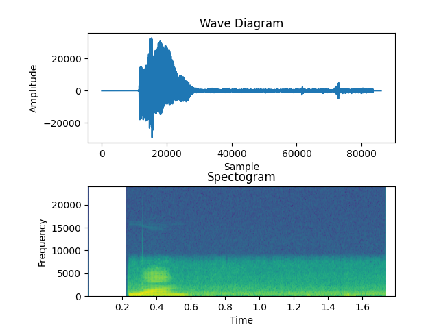

# visualizing-audio-data

This is a small python project that helps visualise the audio in (.wav) format as a wavelength graph and a spectogram.

## Audio Visualization

The program visualiser output:
 
1. The upper subplot is a visualization of the waveform of the audio
2. The lower subplot is a spectograph of the diagram


## Compilation Instructions

1. Download the repository 
2. Place the audios you wish to analyse in the Audio Folder
3.   a)Run the program on any IDE 
     b)Run it on command line using 
     ```
     python3 visualiser.py
     ```
4. The images will be stored with the same name as the audio (in .png format) in the img folder.

###Additionally

1. The Audio folder containers the pronounciation of the ten digits (1-10).


